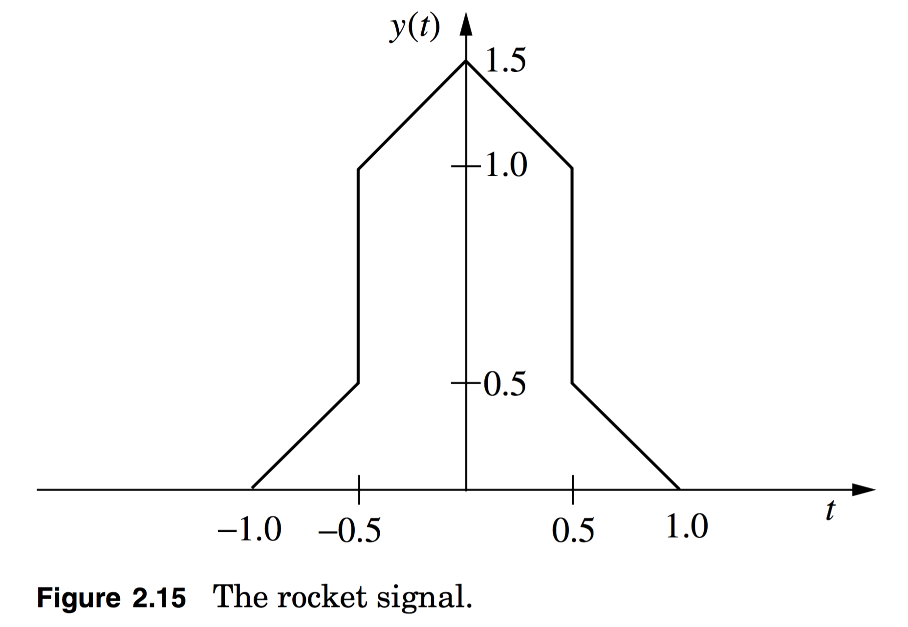

# hw02

##1.
**2.14**

Pulse shapes will be important in digital communication systems.  A Gaussian pulse shape arises in several applications and is given as
$$
x(t)=\frac{1}{\sqrt{2\pi\sigma^2}}{\exp{\left[-\frac{t^2}{2\sigma^2}\right]}}
$$
**(a)** plot $$x(t)$$ for $$\sigma=0.25,\:1,\:4$$.

**(b)** Calculate $$X(f)$$.
**Hint**:
$$
\frac{1}{\sqrt{2\pi}}\int_{-\infty}^{\infty}{\exp{\left[-\frac{x^2}{2}+ax\right]dx}=\exp{\left[\frac{a^2}{2}\right]}}
$$

**(c)** Plot $$G_X(f)$$ for $$\sigma=0.25,\:1,\:4$$ using a dB scale on the $$y$$-axis.

**NOTE**:  a Gaussian pulse shape is used in 2G communication.

##2.
**2.15**

A common signal has a Fourier series representation of
$$
x(t)=\frac{4}{\pi}\sum_{k=0}^{\infty}{\frac{(-1)^k}{2k+1}\cos{\left(10\pi(2k+1)t\right)}}
$$

**(a)** Plot $$x(t)$$ for one period of the signal.

**(b)** Find $$P_x$$.

**(c)** What is the 98% power bandwidth, $$B_{98}$$, of $$x(t)$$?

**HINT**:  Use Matlab to plot the Fourier series, (use, say, 10 elements of the sum) to get an idea what this function is.

##3.
**2.20**

An energy spectrum has a peak value of 0.02. Find the value the energy spectrum must go below to be

**(a)**    40-dB below the peak.

**(b)**    3-dB below the peak.

##4.
**2.22**

A concept that often finds utility in engineering practice is the concept of group delay. For a linear system with a transfer function denoted
$$
H(f)=H_{A}(f)\exp{\left[jH_{p}(f)\right]}
$$
the group delay of this linear system is defined as
$$
\tau_{g}(f)=-\frac{1}{2\pi}\frac{d}{df}H_{p}(f)
$$
Group delay is often viewed as the delay experienced by a signal at frequency f when passing through the linear system H(f).

**(a)** An ideal delay element has an impulse response given as $$h(t)=\delta(t-\tau_d)$$, where $$\tau_d>0$$ is the amount of delay.  Find the group delay of an ideal delay element.

**(b)** An example low pass filter has
$$
H(f)=\frac{1}{j2\pi{f}+a}
$$
Plot the group delay of this filter for $$0\le{f}\le5a.

**(c)** Give a nontrivial $$H(f)$$ that has $$\tau_g(f)=0$$.  In your example is the filter causal or anticausal?

##5.
**2.23**

An interesting characteristic of the Fourier transform is linearity and linearity can be used to compute the Fourier transform of complicated functions by decomposing these function into sums of simple functions.

**(a)** Prove if $$y(t)=x_1(t)+x_2(t)$$, then $$Y(f)=X_1(f)+X_2(f)$$.

**(b)** Find the Fourier transform of the signal given in Figure 2.15.

##6.
**4.3**

If the lowpass components for a bandpass signal are of the form
$$
x_{I}(t)=12\cos{\left(6\pi{t}\right)}+3\cos{\left(10\pi{t}\right)}
$$
and
$$
x_{Q}(t)=2\cos{\left(6\pi{t}\right)}+3\sin{\left(10\pi{t}\right)}
$$

**(a)** Calculate the Fourier series of $$x_I(t)$$ and $$x_Q(t)$$.

**(b)** Calculate the Fourier series of $$x_Z(t)$$.

**(c)** Assuming $$f_c=40\:\text{Hz}$$ calculate the Fourier series of $$x_C(t)$$.

**(d)** Calculate and plot $$x_A(t)$$. Computer might be useful.

**(e)** Calculate and plot $$x_P(t)$$. Computer might be useful.

**NOTE**:
$$
x_{A}(t)=\sqrt{x_{I}^2(t)+x_{Q}^2(t)}
$$
i.e.  it’s the amplitude of the baseband equivalent signal.
$$
x_{P}(t)=\tan^{-1}{\left(\frac{x_{Q}(t)}{x_{I}(t)}\right)}
$$
i.e.  it’s the phase of the baseband equivalent signal.
