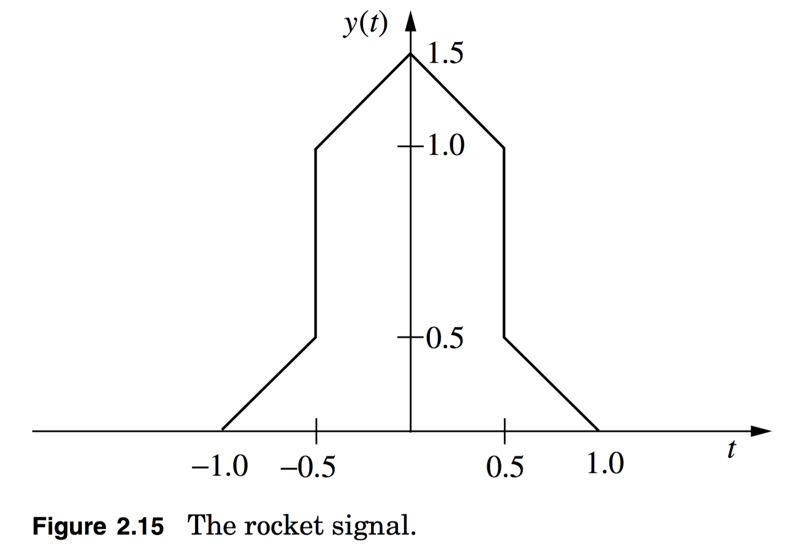

# hw02e

##5.
**2.23**

An interesting characteristic of the Fourier transform is linearity and linearity can be used to compute the Fourier transform of complicated functions by decomposing these function into sums of simple functions.

**(a)** Prove if $$y(t)=x_1(t)+x_2(t)$$, then $$Y(f)=X_1(f)+X_2(f)$$.

**(b)** Find the Fourier transform of the signal given in Figure 2.15.

####5(a)

####5(b)

