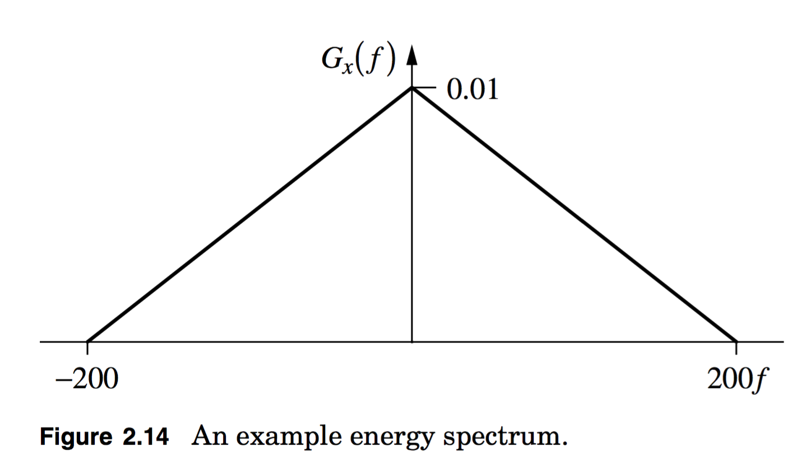
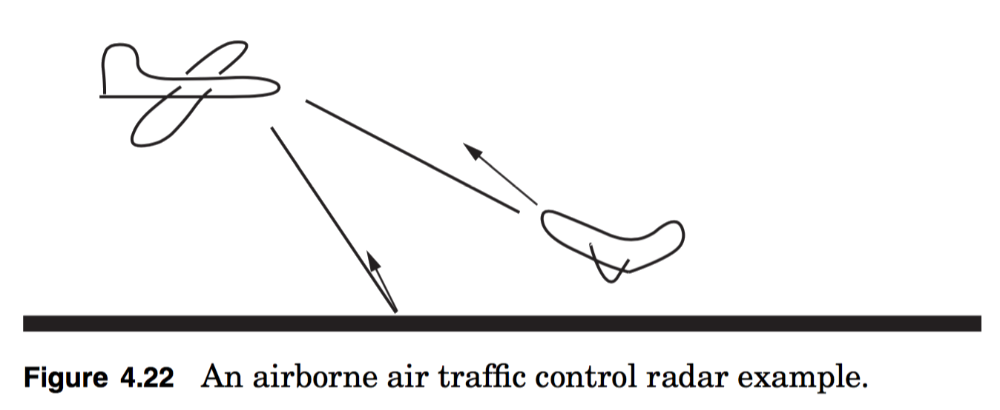
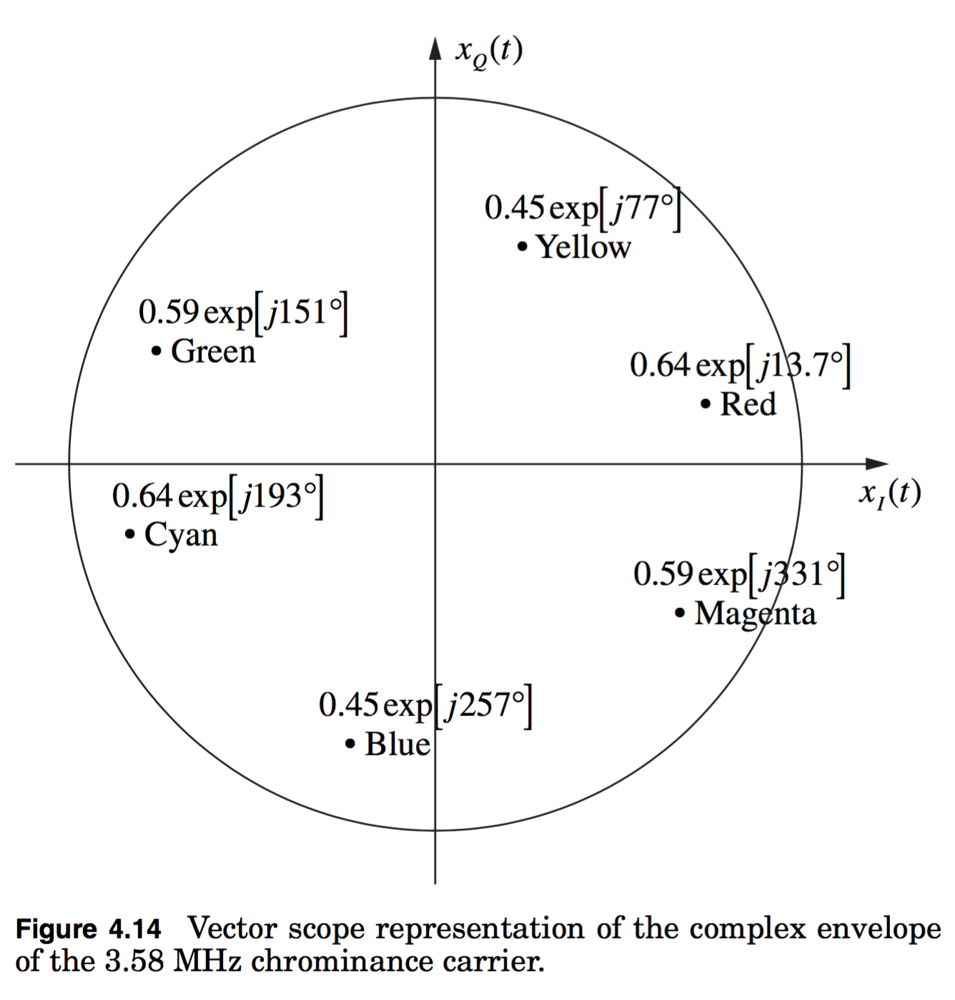

# hw03

##1.
**2.17(modified)**

For the energy spectrum shown in **Figure 2.14** find

**(a)** 3 dB bandwidth,

**(b)** 10 dB bandwidth,

**(c)** 90% bandwidth,

**(d)** 95% bandwidth,

**(e)** The RMS bandwidth (note this is defined on page 2.32 **Problem 2.21** of Fitz)

##2.
**4.5(modified)**

The picture of a color television set proposed by the National Television System Committee (NTSC) is composed by scanning in a grid pattern across the screen.  The scan is made up of three independent beams (red, green, and blue).  These independent beams can be combined to make any color at a particular position.  In order to make the original color transmission compatible with black and white televisions the three color signals  are transformed into a luminance signal (black and white level), $$x_L(t)$$, and two independent chrominance signals, $$x_I(t)$$ and $$x_Q(t)$$. These chrominance signals $$\left(x_r(t),\:\:x_g(t),\:\:x_b(t)\right) $$ are modulated onto a carrier of $$3.58\:\text{MHz}$$ to produce a bandpass signal for transmission.  A commonly used tool for video engineers to understand these coloring patterns is the vectorscope representation shown in **Figure 4.14**.

Write out a baseband TV scan that is: Cyan, Red, Blue, Magenta, Magenta, Cyan.  For example, if I had a TV scan that was Cyan, Red, Cyan, it would look like: 
$$
x_z(t)=0.64\exp{(j1.07\pi)}\sqcap{\left(\frac{t}{T}\right)}+0.64\exp{(j0.21\pi)}\sqcap{\left(\frac{t-T}{T}\right)}+0.64\exp{(j1.07\pi)}\sqcap{\left(\frac{t-2T}{T}\right)}
$$
where $$T$$ is the time duration of the color.

**(a)** Plot the in-phase and quadrature components of your signal.

**(b)** How might you set up a decoder for the color?

##3.
**4.14**

A commercial airliner is flying 15,000 feet above the ground and pointing its radar down to aid traffic control. A second plane is just leaving the runway as shown in **Figure 4.22**. The transmitted waveform is just a carrier tone, 
$$x_z(t)=1$$
or
$$x_c(t)=\sqrt{2}\cos{(2\pi{f_c}t)}.$$
The received signal return at the radar receiver input has the form 
$$
y_c(t)=A_P\sqrt{2}\cos{(2\pi(f_c+f_P)t+\theta_P)}+A_G\sqrt{2}\cos{(2\pi(f_c+f_G)t+θ_G)}
$$
where the P subscript refers to the signal returns from the plane taking off and the G subscript refers to the signal returns from the ground. The frequency shift is due to the Doppler effect you learned about in your physics classes.

**(a)** Why does the radar signal bouncing off the ground (obviously stationary) produce a Doppler frequency shift?

**(b)** Give the complex baseband form of this received signal.

**(c)** Assume the radar receiver has a complex baseband impulse response of
$$
h_z(t)=\delta(t)+\beta\delta(t-T)
$$
where $$\beta$$ is a possibly complex constant, find the value of $$\beta$$ which eliminates the returns from the ground at the output of the receiver.  This system was a common feature in early radar systems and has the common name Moving Target Indicator (MTI) as stationary target responses will be canceled in the filter given in Eq. (4.43).

Modern air traffic control radars are more sophisticated than this problem suggests. An important point of this problem is that radar and communication systems are similar in many ways and use the same analytical techniques for design.

##4.
**4.19**
A bandpass signal has a complex envelope given as 
$$
x_z(t)=j\exp{\left[-j2\pi{f_m}t\right]}+3\exp{\left[j2\pi{f_m}t\right]}
$$
where $$f_m>0$$.

**(a)** Find $$x_I(t)$$ and $$x_Q(t)$$.

**(b)** Plot the frequency domain representation of this periodic baseband signal using impulse functions.

**(c)** Plot the frequency domain representation of the bandpass signal using impulse functions.

**(d)** What is the bandpass bandwidth of this signal, $$B_T$$?