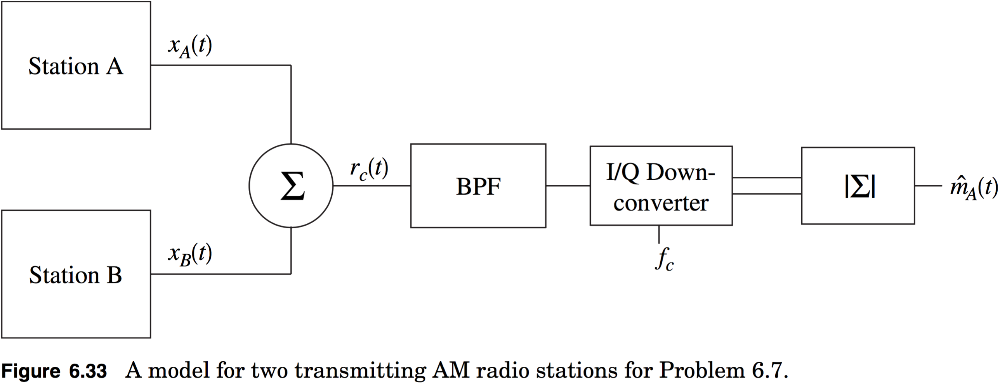

# hw04

##1.
**5.3(modified)**

A message signal is to be transmitted using analog modulation. The message signal Fourier transform has the form
$$
M(f)=\begin{cases}A\left|\sin{\left(\frac{\pi{f}}{W}\right)}\right|&|f|\leq{W}\\0&\text{elsewhere}\end{cases}
$$

**(a)** Compute the value of $$A$$ such that $$E_m$$ is equal to $$1\:\text{J}$$ in a $$1\:\Omega$$ system.

**(b)** Compute the min $$m(t)$$.

**(c)** Compute the max $$|m(t)|$$.

**(d)** Compute the max $$|\frac{d}{dt}m(t)|$$.

> **NOTE**:

> Don’t do part (d). In this problem, it might be easier to find the inverse Fourier transform directly You may want to use the fact that
$$
\int_{0}^{W}{\sin{(2\pi{f}t_0)}e^{-j2\pi{f}t}df}=-\int_{0}^{W}{\sin{(2\pi{f}t_0)}e^{j2\pi{f}t}df};
$$
It’s easiest to use Matlab to find maximum and minimum values in some cases. In addition: Find an expression for $$m(t)$$ and show how you would modulate it using Double sideband modulation and single sideband modulation.

##2.
**6.7(modified)**

The Federal Communications Commission (FCC) makes each station strictly limit their output frequency content. Assume AM stations pro- duce a usable audio bandwidth of $$10\:\text{kHz}$$. AM stations in the same geographical area are normally spaced at least 30 kHz apart. As an example of why limits on the frequency content are necessary the following problem is posed.

Consider two stations broadcasting in the same geographic area with a receiver tuned to one of them as shown in **Figure 6.33**. Station A is broad- casting a $$1\:\text{V}$$ peak sinewave of $$2\:\text{kHz}$$, $$m_A(t)$$ (a test of the emergency broadcast system), at a center frequency of $$f_c\:\text{Hz}$$. Station B is broadcasting a $$1\:\text{V}$$ peak $$3\:\text{kHz}$$ square wave, $$m_B(t)$$, at $$f_c+30\:\text{kHz}$$ with no filtering at the transmitter. Since each transmitted waveform will have a different propagation loss, the received waveform is given by the form
$$
\begin{align*}
r_c(t)&=A_A[(1.5+m_A(t))\sqrt{2}\cos{(2\pi{f_c}t+\phi_A)}]\\
&+A_B[(1.5+m_B(t))\sqrt{2}\cos{(2π(f_c+30000)t+\phi_B)}]
\end{align*}
$$
Assume without loss of generality that the phase shift for the station A is zero, i.e., $$\phi_A=0$$.

(a) Give the complex envelope of the received signal, $$r_z(t)$$.

(b) Find the spectrum (Fourier series coefficients)of the complex envelope, $$r_z(t)$$.

(c) The demodulator has an ideal bandpass filter with a center frequency of $$f_c$$ and a two-sided bandwidth of $$2W=15\:\text{kHz}$$ followed by an envelope detector as shown in **Figure 6.33**. Plot the output demodulated waveform, $$\hat{m}_A(t)$$, over $$5\:\text{ms}$$ of time for several values of $$\phi_b$$ in the range $$[0,\:2\phi]$$ and $$A_B=0.1,\:1,\:10$$.

The distortion you see in this example is called adjacent channel interference and one of the FCC’s functions is to regulate the amount of interference each station produces for people trying to receive another station.

> **NOTE**:

> Assume that $$A_A=1$$ and assume that $$m_B(t)$$ is a square-wave with 50% duty cycle. (DC value for $$m_B(t)=\frac{1}{2}$$)

##3.
**3.4**

Your roommate challenges you to a game of chance. He proposes the following game. A coin is flipped two times, if heads comes up twice she/he gets a dollar from you and if tails comes up twice you get a dollar from him/her. You know your roommate is a schemer so you know that there is some chance that this game is rigged. To this end you assign the following mathematical framework.
$$
\begin{align*}
P(F):&\text{probability that the game is fair}\\&=\frac{5}{6}\\
P(H|F):&\text{probability that a head results if the game is fair}\\&=0.5\\
P(H|UF):&\text{probability that a head results if the game is unfair}\\&=0.75
\end{align*}
$$

Assume conditioned on the fairness of the game that each flip of the coin is independent.

**(a)** What is the probability that the game is unfair, $$P(UF)$$?

**(b)** What is the probability that two heads appear given the game is unfair?

**(c)** What is the probability that two heads appear?

**(d)** If two heads appear on the first trial of the game, what is the probability that you are playing an unfair game?

##4.
**3.16(modified)**

Consider a uniform random variable with the PDF given in Eq. (3.16) with $$a=0$$ and $$b=1$$.

(a) Compute $$m_Y$$.

(b) Compute $$\sigma_X$$.

(c) Compute $$P(X\leq0.4)$$.

(d) Use rand in Matlab and produce 100 independent samples of a uniform random variable. How many of these 100 samples are less than or equal to 0.4? Does this coincide with the results you obtained in (c)?.

> **NOTE**:

> In part (d) your answer should not be exactly equal to (c). Explain why (briefly). Also in part (a) assume $$m_X=E[X]$$ not $$m_Y$$.
