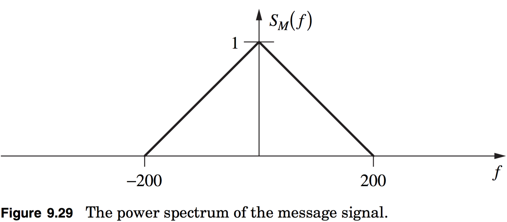
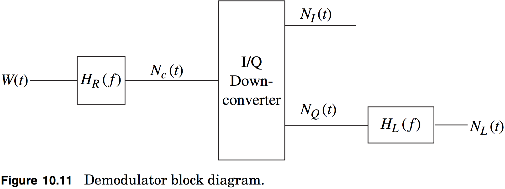
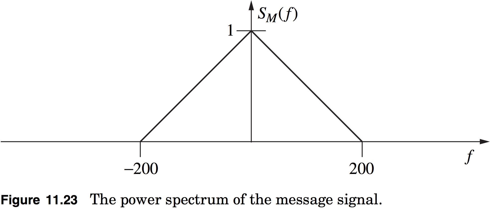

# hw06

## 9.22
Often in engineering practice message signals are modeled as random processes.  Assume $$M(t)$$ is a Gaussian random process with the power spectrum given in Figure 9.29.

**(a)** What is the power of this signal, $$P_m$$?

**(b)** Find the PDF of one sample of this message signal.

**(c)** What is the correlation function of the message signal, $$R_M(\tau)$$?

**(d)** Find and plot the PDF of two samples of this message signal taken $$\tau=\tfrac{1}{200}\:\text{s}$$ apart.

**(e)** Find and plot the PDF of two samples of this message signal taken $$\tau=\tfrac{0.25}{200}\:\text{s}$$ apart.

## 10.12
Real valued additive white Gaussian noise, $$W(t)$$, with a two-sided spectral density $$\tfrac{\mathcal{N}_0}{2}$$ is input into a demodulator which has a block diagram shown in Figure 10.11. The time-invariant filter has a transfer function of
$$
H_R(f)=\begin{cases}2&f_c-100\leq|f|\leq{f}_c+100\\0&\text{elsewhere}\end{cases}
$$

**(a)** Find the power spectral density of $$N_c(t)$$, $$S_{N_c}(f)$$.

**(b)** $$E[N_c^2(t)]=2$$, what is $$\mathcal{N}_0$$?

**(c)** Find the power spectral density of $$N_I(t)$$, $$S_{N_I}(f)$$ when $$E[N_c^2(t)]=2$$.

**(d)** Find $$E[N_I^2(t)]$$ for the value of $$\mathcal{N}_0$$ obtained in (b).

**(e)** Assume that $$H_L(f)$$ is an ideal lowpass filter with $$H_L(0)=1$$. Choose the bandwidth of the filter such that $$E[N_L^2(t)]=\tfrac{1}{2}E[N_I^2(t)]$$.

> **NOTE**: In this problem recall from the quiz that $$R_{n_c}(\tau)=2R_{n_I}(\tau)\cos{(2\pi{f}_c\tau)}$$

## 11.12
Consider a situation where a message signal is modeled as a stationary Gaussian random process with a PSD given in Figure 11.23.  Assume this signal is corrupted by an additive white Gaussian noise with a one–sided spectral density of $$\mathcal{N}_0$$.  This combined signal plus noise is put into an ideal lowpass filter that has a bandwidth of $$W$$. Choose $$W$$ to optimize the output SNR and give the value of this optimum SNR.

> **NOTE**: For the noise, assume the power spectral density is $$S_n(f)=\tfrac{\mathcal{N}_0}{2}$$

## custom.01
Given baseband zero-mean, white Gaussian noise process $$n_I(t)$$, let $$N=\int{n_I(t)h(t)dt}$$,

**(a)** Why can we model $$N$$ as a Gaussian random variable?

**(b)** Suppose $$h(t)=\tfrac{1}{T}\text{sinc}{\left(\tfrac{t}{T}\right)}$$ where $$T=\tfrac{1}{2W}$$ and $$S_{n_I}(f)=10^{−6}$$. What is the mean and variance of $$N$$?

## custom.02
Suppose you have the pulse $$p(t)=\tfrac{1}{\sqrt{T}}\text{sinc}{\left(\tfrac{t}{T}\right)}$$.
You transmit a $$0$$ by sending $$-p(t)$$ and you transmit a $$1$$ by sending $$p(t)$$.  Suppose you have a 1-shot system, i.e. you only said 1 bit and then you close down the transmitter.
So $$x(t)=c_kp(t)$$ where $$c=\pm1$$. Also assume that $$\int{p^2(t)dt}=1$$

**(a)** Show that $$\int{x_z(t)p(t)dt}=c_k$$.

**(b)** What is the bandwidth of this system?  You can leave your answers in terms of $$T$$.

**(c)** What is the bit rate of this system?

**(d)** Suppose you receive $$y_z(t)=x_z(t)+n_I(t)+jn_Q(t)$$.  Your receiver has the following set of operations. First you filter then you take the real part.  So your decision variable is $$Z=\Re{\left(\int{y_z(t)p(t)dt}\right)}$$.

**(i)** Find the energy of the signal (ignoring the noise).

**(ii)** Find the energy of the noise and give an expression for the SNR.

**(iii)** Your rule is if $$Z>0$$, a $$1$$ was sent, if $$Z<0$$, a $$0$$ was sent. What is the probability of error?
