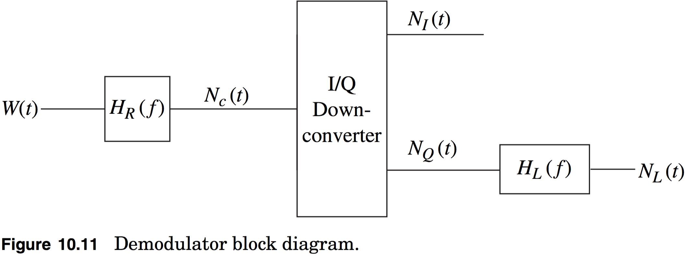

# hw06b

## 10.12
Real valued additive white Gaussian noise, $$W(t)$$, with a two-sided spectral density $$\tfrac{\mathcal{N}_0}{2}$$ is input into a demodulator which has a block diagram shown in Figure 10.11. The time-invariant filter has a transfer function of
$$
H_R(f)=\begin{cases}2&f_c-100\leq|f|\leq{f}_c+100\\0&\text{elsewhere}\end{cases}
$$

**(a)** Find the power spectral density of $$N_c(t)$$, $$S_{N_c}(f)$$.

**(b)** $$E[N_c^2(t)]=2$$, what is $$\mathcal{N}_0$$?

**(c)** Find the power spectral density of $$N_I(t)$$, $$S_{N_I}(f)$$ when $$E[N_c^2(t)]=2$$.

**(d)** Find $$E[N_I^2(t)]$$ for the value of $$\mathcal{N}_0$$ obtained in (b).

**(e)** Assume that $$H_L(f)$$ is an ideal lowpass filter with $$H_L(0)=1$$. Choose the bandwidth of the filter such that $$E[N_L^2(t)]=\tfrac{1}{2}E[N_I^2(t)]$$.

> **NOTE**: In this problem recall from the quiz that $$R_{n_c}(\tau)=2R_{n_I}(\tau)\cos{(2\pi{f}_c\tau)}$$

