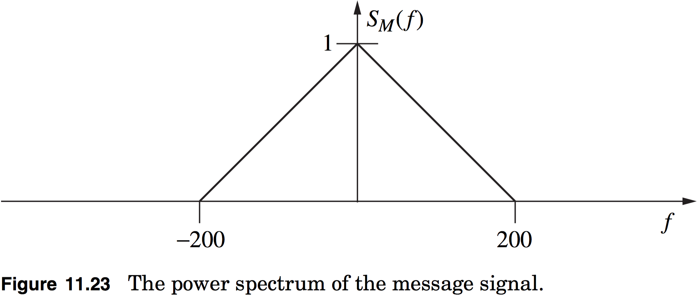

# hw06c

## 11.12
Consider a situation where a message signal is modeled as a stationary Gaussian random process with a PSD given in Figure 11.23.  Assume this signal is corrupted by an additive white Gaussian noise with a one–sided spectral density of $$\mathcal{N}_0$$.  This combined signal plus noise is put into an ideal lowpass filter that has a bandwidth of $$W$$. Choose $$W$$ to optimize the output SNR and give the value of this optimum SNR.

> **NOTE**: For the noise, assume the power spectral density is $$S_n(f)=\tfrac{\mathcal{N}_0}{2}$$

