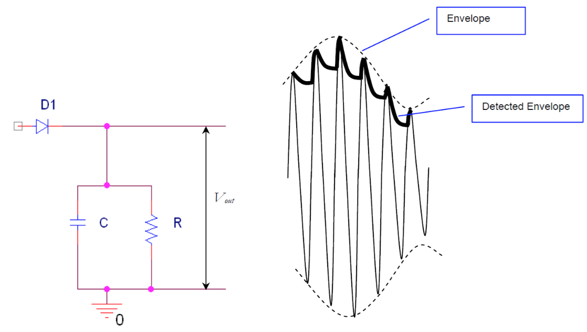

# lab03

## TITLE
AM Signal Modulation and Demodulation

## INTRODUCTION:
Amplitude Modulation (AM) is a linear analog modulation technique.
Given a message $$m(t)=\cos{(2\pi{f}_mt)}$$, the corresponding AM signal is given by:
$$s(t)=A_c[1+a\cos{(2\pi{f}_mt)}]\cos{(2\pi{f}_ct)}$$
where, $$1+a\cos{(2\pi{f}_mt)}>0\:\:\:\:\forall{t}$$. The amplitude of the high frequency (carrier) of the signal is controlled by the low frequency (modulating) signal.

The demodulation is achieved using an envelope detector which consists of a diode followed by an RC circuit. When the input voltage is positive, the capacitor charges and when the input goes negative, the diode becomes an open circuit and voltage on the capacitor exponentially decays at a rate determined by the time constant ($$\tau=RC$$).

By choosing an appropriate value for the time constant ($$\frac{1}{2\pi{f}_c}\ll\tau=RC\ll\tfrac{1}{W}$$, where "$$W$$" is bandwidth of the message signal) the voltage will closely follow the envelope of the modulated signal.

## OBJECTIVES:
1. To modulate a carrier signal with a message to generate an AM signal with a specified modulation index, ‘$$a$$’.
2. To measure the modulation index ‘$$a$$’ of an AM signal.
3. To demodulate an AM signal using an envelope detector.

## PRE-LAB:
1. Read ‘Analog Transmission’ (refer *Fitz* 5.2).
2. Read ‘Modulator and Demodulator’ (refer *Fitz* 6.2.1).

## EQUIPMENTS:
- Series Signal Generator
- Oscilloscope
- Spectrum Analyzer

## LAB:
1. Write a MATLAB script for Amplitude Modulation and Demodulation.

2. Create a Simulink Model for Amplitude Modulation.

3. Procedure for getting the Modulated Signal:
	1. Set frequency to $$100\:\text{KHz}$$ and amplitude to $$3\:\text{Vpp}$$.
	2. Use the AM function on the signal generator to modulate a sine wave of $$1\:\text{KHz}$$ and a modulation index of $$0.5$$. Sketch the waveform produced on the oscilloscope.
	3. Change the modulation index to $$0.9$$ and observe what happens to the waveform?
	4. Find the modulation index from the oscilloscope and compare your result with the signal generator.
	$$
	a\text{max}(t)=\frac{(e_{\text{max}}-e_{\text{min}})}{(e_{\text{max}}+e_{\text{min}})}
	$$
	*e.g.*,
	$$
	a=\frac{(443.8\:\text{mV}-125\:\text{mV})}{(443.8\:\text{mV}+125\:\text{mV})}≈56
	$$

4. Procedure for getting the Demodulated Signal:
	1. Build an envelope detector, (Use IN4001, $$R=10k\Omega$$, $$C=0.01\:\mu\text{F}$$).
	2. Feed the signal into the envelope detector, view the waveforms at the different nodes and sketch them.
	

5. Get an antenna and hook it up to the spectrum analyzer. Look for some AM radio signals ($$540$$ to $$1600\:\text{kHz}$$). When you find one, put it as the central frequency and then in the span options choose ‘zero span’. Now hit the ‘Aux Crtl’ button and choose ‘Demod on’. Move the antenna to get the best possible reception.

