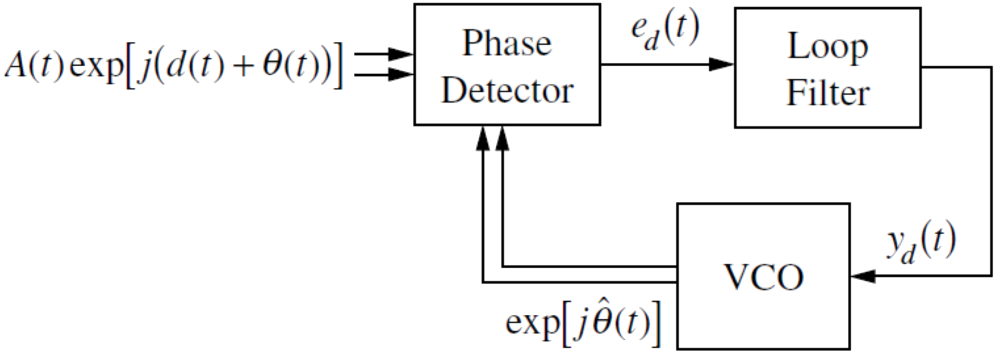

# lab06

## TITLE:
Central Limit Theorem (CLT)


##INTRODUCTION:



The phase-locked loop (PLL) is a commonly used component in communication systems. It can be used for tracking the phase and frequency of signals, demodulating angle modulated signals, and frequency source synthesis. The input complex signal into a PLL has amplitude variation $$A(t)$$, a phase variation, $$\Theta(t)$$, and a nuisance phase variation, $$d(t)$$... The goal of a PLL, in most cases, is to track and/or estimate the value of $$\Theta(t)$$. The typical PLL, as seen in above figure, has three components: the phase detector, the loop filter, and the voltage controlled oscillator (VCO). - *Fitz.* 3.3.5


##OBJECTIVES:
1. To model a PLL in MATLAB
2. To use this model to understand the working of a PLL.


##PRE-LAB:
1. Read ‘Phase Locked Loops’ (refer *Fitz* 8.1).


## EQUIPMENTS:
1. MATLAB Software


## LAB:
1. Use the given `PLL.m` in your current working directory, run it and view the output. Put the graph in your report.
2. What is the PLL doing?
3. Go through the code and comment in purpose of each part.
4. What things could we do to make the PLL work better?
5. Implement some trials of making it better and show the outputs.
6. What could make it worse?
7. Show a scenario when the input is not recognizable in the output.

##`PLL.m`
```matlab
%
% Try to model a PLL
%
theta(1) = 0;
thetaStart(1) = rand;

for mm=1:10
	for ii=1:1000
		t = (ii-1)*.01;
		theta(ii) = sin(  2*pi*0.05*t  );
		thetaDiff(ii) = cos(  2*pi*10*t + theta(ii)  )...
						* sin(  2*pi*10*t + thetaStart(ii));
		if (ii>1)
			% lpf
			thetaDiff(ii) = .5*thetaDiff(ii) + 0.5*thetaDiff(ii-1);
		end
		thetaStart(ii+1) = thetaStart(ii) - 0.2*thetaDiff(ii);
	end
end
```
