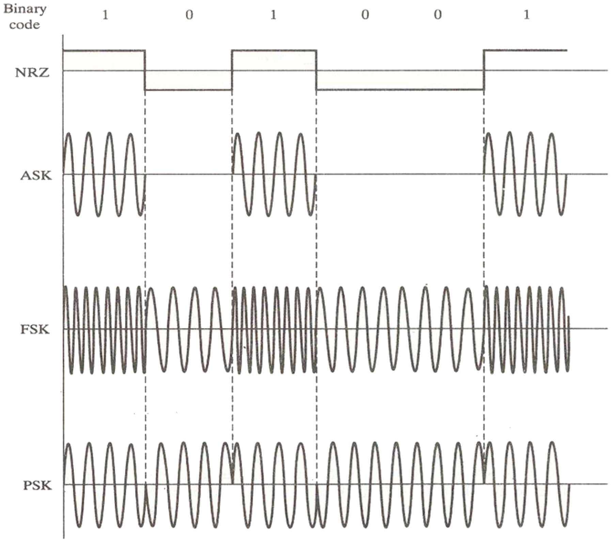

# lab07

## TITLE:
Digital Modulation to Detect a Message

## INTRODUCTION:
In binary modulation schemes, the modulation process corresponds to switching (or keying) the amplitude, frequency or phase of the continuous-wave carrier between either of two values corresponding to binary symbols “0” or “1”. The three types of digital modulation are amplitude- shift keying (ASK), frequency-shift keying (FSK) and phase-shift keying (PSK).

## OBJECTIVES:
1. To model ASK, FSK and PSK modulation in MATLAB.
2. To detect a message contained in the signal with Additive white Gaussian noise.

## EQUIPMENTS:
1. MATLAB Software

## LAB:
1. Write a script for ASK, FSK and PSK modulation in MATLAB

2. Download the MATLAB file `Project1.mat` and load it using the command `load('Project1.mat')`;

3. The signal is sent through a BPSK system. Use a matched filter to recover the bits, build a bit string and match symbols and assign letters to decode the message.

4. Display the message using the command display(msg).
