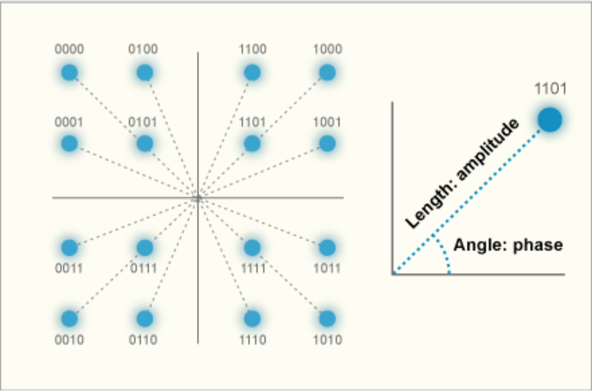
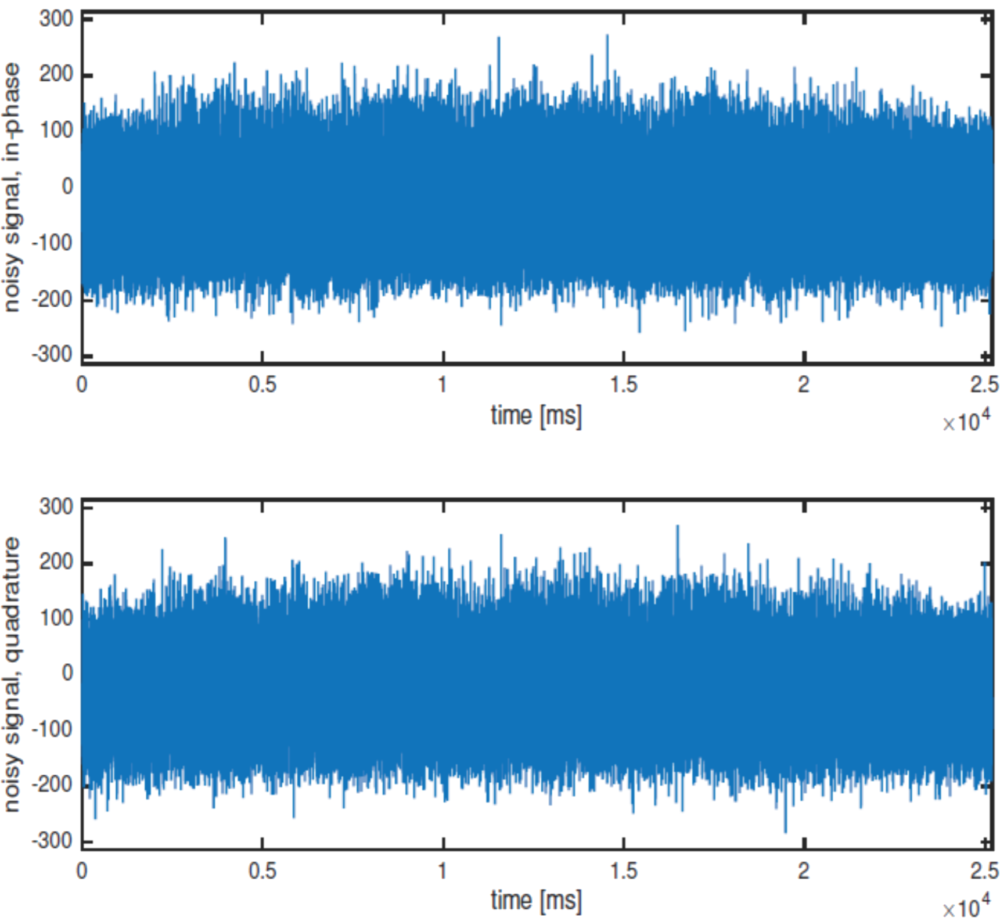

# lab08

## TITLE:
Project 1b

## INTRODUCTION:
Quadrature amplitude modulation (QAM), combines amplitude modulation and phase modulation. QAM modulates the amplitude of two separate waves that are out of phase by 90 degrees, with different number of combinations of amplitude and phase. One signal is called the I signal (In phase), and the other is called the Q signal(Quadrature). Mathematically, one of the signals can be represented by a sine wave, and the other by a cosine wave. The two modulated carriers are combined at the source for transmission. At the destination, the carriers are separated, the data is extracted from each, and then the data is combined into the original modulating information.

## OBJECTIVES:
1. To detect a message contained in the signal with Additive white Gaussian noise modulated using 4-QAM.

## EQUIPMENTS:
1. Matlab Software

## LAB:
1. Download the MATLAB file `Project1b.mat`.It contains a baseband signal in additive white Gaussian noise as shown in the figure below. Load it using the command `load('Project1b.mat')`.

2. Load it using the command `load('Project1b.mat');` The signal corresponds to a sequence of 50,400 information bits, modulated using 4-QAM with constellation $$\{\pm1\pm{j}\}$$ and a rectangular pulse of duration $$T=1\:\text{ms}$$. The baseband signal is represented by samples taken at $$16\:\text{kHz}$$. You have to detect the message contained in this signal.

3. First detect the information bits using a matched filter followed by the sampler and the decision device. From the so-obtained bit decisions, decipher the underlying message.

4. The message is an image of size $$210\times240$$ pixels. Each pixel is of value $$0$$ or $$1$$, corresponding to the two colors contained in the image.

5. At the transmitter, the data sequence is generated from the image as follows. The image is stored in a $$210\times240$$ matrix $$B$$. The columns of $$B$$ are read out one by one to form a bit sequence
$$
b=\left[\begin{matrix}
B(1,\:1),&B(2,\:1),&\cdots&B(210,\:1),\\
B(1,\:2),&B(2,\:2),&\cdots&B(210,\:2),\\
\vdots&&\ddots&\vdots&\\
B(1,\:240),&B(2,\:240),&\cdots&B(210,\:240)
\end{matrix}\right]
$$
of length $$210\times240=50,400$$. (This can be done in Matlab using the command `b=reshape(B,1,50400)`.) The resulting $$0/1$$ bit stream is converted from serial to parallel, such that the first bit goes to the in-phase branch, the second to the quadrature branch, the third to the in-phase branch, and so on. In each branch, the logical $$0/1$$ bits are then mapped into the $$-1/+1$$ values, which are used to generate the 4-QAM signal.

6. Once you have made the bit decisions, you will need to reconstruct the matrix $$B$$. To finally see the image, execute the following command: `imagesc(B)`.
