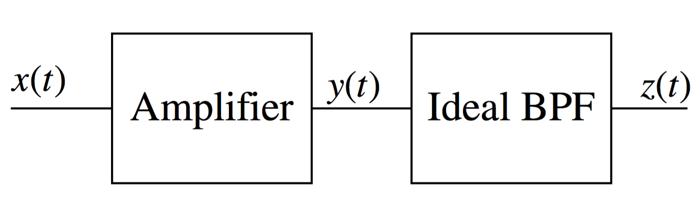

# **hw01**

##2.1
Let two complex numbers be given as 
$$
    \begin{align*}
    z_1&=x_1+jy_1=\alpha_1\exp{\left(j\theta_1\right)};\\
    z_2&=x_2+jy_2=\alpha_2\exp{\left(j\theta_2\right)};
    \end{align*}
$$

Find
1. $$\Re{\left[z_1+z_2\right]}$$
2. $$\left|z_1+z_2\right|$$
3. $$\Im{\left[z_1z_2\right]}$$
4. $$\arg{\left[z_1z_2\right]}$$
5. $$\left|z_1z_2\right|$$

#### 2.1.1
$$
    \begin{align*}
    \Re{\left[z_1+z_2\right]}&=\Re{\left[x_1+jy_1\right]}+\Re{\left[x_2+jy_2\right]}\\
    &=x_1+x_2\\
    \Re{\left[z_1+z_2\right]}&=\Re{\left[\alpha_1\cos{(\theta_1)+j\left(\alpha_1\sin{(\theta_1)}\right)}\right]}+\Re{\left[\alpha_2\cos{(\theta_2)+j\left(\alpha_2\sin{(\theta_2)}\right)}\right]}\\
    &=\alpha_1\cos{(\theta_1)}+\alpha_2\cos{(\theta_2)}
    \end{align*}
$$
#### 2.1.2
$$
    \begin{align*}
    \left|z_1+z_2\right|&=\left|\left((x_1+x_2)+j(y_1+y_2)\right)\right|=\sqrt{(x_1+x_2)^2+(y_1+y_2)^2}\\
    &=\sqrt{x_1^2+x_2^2+2x_1x_2+2y_1y_2};\\
    \left|z_1+z_2\right|&=\left|\left(\alpha_1\cos{(\theta_1)}+\alpha_2\cos{(\theta_2)}\right)+j\left(\alpha_1\sin{(\theta_1)}+\alpha_2\sin{(\theta_2)}\right)\right|\\
    &=\sqrt{\left(\alpha_1\cos{(\theta_1)}+\alpha_2\cos{(\theta_2)}\right)^2+\left(\alpha_1\sin{(\theta_1)}+\alpha_2\sin{(\theta_2)}\right)^2}\\
    &=\sqrt{\alpha_1^2\cos^2{(\theta_1)}+\alpha_1^2\sin^2{(\theta_1)}+\alpha_2^2\cos^2{(\theta_2)}+\alpha_2^2\sin^2{(\theta_2)}+2\alpha_1\alpha_2\cos{(\theta_1)}\cos{(\theta_2)}+2\alpha_1\alpha_2\sin{(\theta_1)}\sin{(\theta_2)}}\\
    &=\sqrt{\alpha_1^2+\alpha_2^2+2\alpha_1\alpha_2\cos{(\theta_1)}\cos{(\theta_2)}+2\alpha_1\alpha_2\sin{(\theta_1)}\sin{(\theta_2)}}\\
    &\left<\cos{(a)}\cos{(b)}=\frac{1}{2}\left(\cos{(a-b)}+\cos{(a+b)}\right)\right>\\
    &\left<\sin{(a)}\sin{(b)}=\frac{1}{2}\left(\cos{(a-b)}-\cos{(a+b)}\right)\right>
    &=\sqrt{\alpha_1^2+\alpha_2^2+2\alpha_1\alpha_2\left(\frac{1}{2}\left[\cos{(\theta_1-\theta_2)}+\cos{(\theta_1+\theta_2)}\right]\right)+2\alpha_1\alpha_2\left(\frac{1}{2}\left[\cos{(\theta_1-\theta_2)}-\cos{(\theta_1+\theta_2)}\right]\right)},\\
    &=\sqrt{\alpha_1^2+\alpha_2^2+2\alpha_1\alpha_2\cos{(\theta_1-\theta_2)}}
    \end{align*}
$$

#### 2.1.3
$$
    \begin{align*}
    \Im{\left[z_1z_2\right]}&=\Im{\left[(x_1+jy_1)(x_2+jy_2)\right]}=\Im{\left[x_1x_2-y_1y_2+j\left(x_1y_2+x_2y_1\right)\right]}\\
    &=x_1y_2+x_2y_1;\\
    \Im{\left[z_1z_2\right]}&=\Im{\left[\alpha_1\alpha_2e^{j\left(\theta_1+\theta_2\right)}\right]}=\Im{\left[\alpha_1\alpha_2\cos{(\theta_1+\theta_2)}+j\left(\alpha_1\alpha_2\sin{(\theta_1+\theta_2)}\right)\right]}\\
    &=\alpha_1\alpha_2\sin{(\theta_1+\theta_2)};
    \end{align*}
$$

#### 2.1.4
$$
    \arg{\left[z_1z_2\right]}=\arg{\left[\alpha_1\alpha_2e^{j\left(\theta_1+\theta_2\right)}\right]}=\theta_1+\theta_2
$$

#### 2.1.5
$$
    \begin{align*}
    \left|z_1z_2\right|&=\left|(x_1+jy_1)(x_2+jy_2)\right|=\left|\left(x_1x_2-y_1y_2\right)+j\left(x_1y_2+x_2y_1\right)\right|\\
    &=\sqrt{\left(x_1x_2-y_1y_2\right)^2+\left(x_1y_2+x_2y_1\right)^2}\\
    &=\sqrt{x_1^2x_2^2+y_1^2y_2^2-2x_1x_2y_1y_2+x_1^2y_2^2+x_1^2y_2^2+2x_1x_2y_1y_2}\\
    &=\sqrt{x_1^2x_2^2+y_1^2y_2^2+x_1^2y_2^2+x_1^2y_2^2}=\sqrt{(x_1^2+y_1^2)(x_2^2+y_2^2)}\\
    \left|z_1z_2\right|&=\left|\alpha_1\alpha_2e^{j(\theta_1+\theta_2)}\right|=\alpha_1\alpha_2;
    \end{align*}
$$

## 2.3
Consider the two signals
$$
    \begin{align*}
    x_1(t)=m(t)\cos(2\pi{f_c}t)\\ 
    x_2(t)=m(t)\sin(2\pi{f_c}t)
    \end{align*}
$$

where the bandwidth of m(t) is much less than fc. Compute the simplest form for the following four signals 
1. $$y_1(t)=x_1(t)\cos(2\pi{f_c}t)$$
2. $$y_2(t)=x_1(t)\sin(2\pi{f_c}t)$$
3. $$y_3(t)=x_2(t)\cos(2\pi{f_c}t)$$
4. $$y_4(t)=x_2(t)\sin(2\pi{f_c}t)$$

#### 2.3.1.
$$
    \begin{align*}
    y_1(t)&=x_1(t)\cos(2\pi{f_c}t)\\
    &=\left(m(t)\cos{(2\pi{f_c}t)}\right)\cos{(2\pi{f_c}t)}\\
    &=m(t)\cos^2{(2\pi{f_c}t)},&&\left<\cos^2{(\theta)}=\frac{1}{2}\left[1+\cos{(2\theta)}\right]\right>\\
    &=m(t)\left(\frac{1}{2}\left[1+\cos{(2\pi(2){f_c}t)}\right]\right)\\
    &=\frac{1}{2}m(t)+\frac{1}{2}m(t)\cos{(2\pi2f_ct)}
    \end{align*}
$$

#### 2.3.2
$$
    \begin{align*}
    y_2(t)&=x_1(t)\sin(2\pi{f_c}t)\\
    &=\left(m(t)\cos{(2\pi{f_c}t)}\right)\sin{(2\pi{f_c}t)}&&\left<\sin{(2\theta)}=2\cos{(\theta)}\sin{(\theta)}\right>\\
    &=m(t)\left(\frac{1}{2}\left[\sin{(2\pi(2){f_c}t)}\right]\right)\\
    &=\frac{1}{2}m(t)\sin{(2\pi2f_ct)}
    \end{align*}
$$

#### 2.3.3
$$
    \begin{align*}
    y_3(t)&=x_2(t)\cos(2\pi{f_c}t)\\
    &=\left(m(t)\sin{(2\pi{f_c}t)}\right)\cos{(2\pi{f_c}t)}&&\left<\sin{(2\theta)}=2\cos{(\theta)}\sin{(\theta)}\right>\\
    &=m(t)\left(\frac{1}{2}\left[\sin{(2\pi(2){f_c}t)}\right]\right)\\
    &=\frac{1}{2}m(t)\sin{(2\pi2f_ct)}
    \end{align*}
$$

#### 2.3.4
$$
    \begin{align*}
    y_4(t)&=x_2(t)\sin(2\pi{f_c}t)\\
    &=\left(m(t)\sin{(2\pi{f_c}t)}\right)\sin{(2\pi{f_c}t)}\\
    &=m(t)\sin^2{(2\pi{f_c}t)},&&\left<\sin^2{(\theta)}=\frac{1}{2}\left[1-\cos{(2\theta)}\right]\right>\\
    &=m(t)\left(\frac{1}{2}\left[1-\cos{(2\pi(2){f_c}t)}\right]\right)\\
    &=\frac{1}{2}m(t)-\frac{1}{2}m(t)\cos{(2\pi2f_ct)}
    \end{align*}
$$

##**2.5**
This problems exercises the signal and system tools. Compute the Fourier transform of 

1.
$$
    x(t)=\begin{cases}A&0\geq{t}\geq{T_p}\\0&\text{elsewhere}\end{cases}
$$
2.
$$
    x(t)=\begin{cases}A\sin{\left(\frac{\pi{t}}{T_p}\right)}&0\geq{t}\geq{T_p}\\0&\text{elsewhere}\end{cases}
$$
and give the value of A such that $$E_u=1.$$ Compute the 40-dB relative bandwidth,$$B_{40}$$, of each signal. 

#### 2.5.1

Let $$x(t)=A\sqcap{\left(\frac{t-\frac{T_p}{2}}{T_p}\right)}$$
Then,
$$
    \begin{align*}
    X(f)&=\mathcal{F}{\left\{x(t)\right\}}=\mathcal{F}{\left\{A\sqcap{\left(\frac{t-\frac{T_p}{2}}{T_p}\right)}\right\}},&&\left<\mathcal{F}{\left\{\sqcap{(t)}\right\}}=\text{sinc}{(f)}\right>\\
    &=A\frac{1}{\left|\frac{1}{T_p}\right|}\text{sinc}{\left(\frac{f}{\left|\frac{1}{T_p}\right|}\right)}e^{-j\left(2\pi{f}\left(\frac{T_p}{2}\right)\right)}\\
    &=T_pA\:\text{sinc}{(T_pf)}\:e^{-j\left(2\pi{f}\left(\frac{T_p}{2}\right)\right)}\\
    G_x(f)&=\left|X(f)\right|^2=(T_P)^2(A)^2\text{sinc}^2{(T_pf)};
    \end{align*}
$$
When $$E_u=1$$, we want 
$$\int{x^2(t)dt}=1$$. It means
$$
    \begin{align*}
    (T_p)^2(A^2)=1;\\
    A=\sqrt{\frac{1}{T_p}};
    \end{align*}
$$
So
$$
    \begin{align*}
    G_x(f)&=(T_P)^2\left(\sqrt{\frac{1}{T_p}}\right)^2\text{sinc}^2{(T_pf)}\\
    &=T_p\text{sinc}^2{(T_pf)};
    \end{align*}
$$

Find $$W$$ such that,
$$
    \begin{align*}
    \left.G(f)\leq{\frac{\text{max}{(G_x(f))}}{10^{\frac{X}{10}}}}\right|_{X=40}=\underline{\frac{(T_p)}{10^{\frac{40}{10}}}},&&\forall{f}\geq{W}
    \end{align*}
$$
Note that
$$
    \begin{align*}
    G(f)&=T_p\text{sinc}^2{(T_pf)}=T_p\frac{\sin^2{((\pi)T_pf)}}{((\pi)T_pf)^2}\leq\underline{\frac{1}{\pi^2T_p{f}^2}}&&
    \end{align*}
$$
Use these relations now.
$$
    \begin{align*}
    \frac{1}{\pi^2T_p{f}^2}&\leq\frac{T_p}{10^4};\\
    \frac{10^4}{\pi^2T_p^2}&\leq{f}^2;\\
    f&\geq\sqrt{\frac{10^4}{\pi^2T_p^2}}=\frac{10^2}{\pi{T_p}};\\\\
    \therefore{W}&=\frac{10^2}{\pi{T_p}};
    \end{align*}
$$

#### 2.5.2

Let $$x(t)=A\sin{\left(\frac{\pi{t}}{T_p}\right)}\sqcap{\left(\frac{t-\frac{T_p}{2}}{T_p}\right)}$$
Then, find $$A$$ such that,
$$
    \begin{align*}
    \int{x^2(t)dt}&=\int_{0}^{T_p}{\left(A\sin{\left(\frac{\pi{t}}{T_p}\right)}\right)^2dt},&&\left<\sin^2{(\theta)}=\frac{1}{2}\left[1-\cos{(2\theta)}\right]\right>\\
    &=A^2\int_{0}^{T_p}{\frac{1}{2}\left[1-\cos{\left(2\left(\frac{\pi{t}}{T_p}\right)\right)}\right]dt}\\
    &=\frac{A^2}{2}\int_{0}^{T_p}{dt}-\underset{0}{\underline{\frac{A^2}{2}\int_{0}^{T_p}{\cos{\left(\frac{2\pi{t}}{T_p}\right)}dt}}}\cdots\\
    &=\frac{A^2T_p}{2}=1;\\\\
    \therefore{A}&=\sqrt{\frac{2}{T_p}};
    \end{align*}
$$
Now,
$$
    \begin{align*}
    x(t)&=\left(\sqrt{\frac{2}{T_p}}\right)\sin{\left(\frac{\pi{t}}{T_p}\right)}\sqcap{\left(\frac{t-\frac{T_p}{2}}{T_p}\right)},&&\left<\sin{(\theta)}=\cos{(\theta-\frac{\pi}{2})}\right>\\
    &=\left(\sqrt{\frac{2}{T_p}}\right)\cos{\left(\frac{\pi{\left(t-\frac{T_p}{2}\right)}}{T_p}\right)}\sqcap{\left(\frac{t-\frac{T_p}{2}}{T_p}\right)}\\
    X(f)&=\mathcal{F}{\left\{x(t)\right\}}=\mathcal{F}{\left\{\left(\sqrt{\frac{2}{T_p}}\right)\cos{\left(\frac{\pi{t}}{T_p}\right)}\sqcap{\left(\frac{t}{T_p}\right)}\right\}},&&\left<\mathcal{F}{\left\{\cos{\left(\frac{\pi{t}}{T_p}\right)}\sqcap{\left(\frac{t}{T_p}\right)}\right\}}=\frac{T_p}{2}\left[\text{sinc}{\left({T_p}\left(f-\frac{1}{2T_p}\right)\right)}+\text{sinc}{\left({T_p}\left(f+\frac{1}{2T_p}\right)\right)}\right]\right>\\
    &=\sqrt{\frac{2}{T_p}}\left(\frac{T_p}{2}\right)\left[\text{sinc}{\left({T_p}\left(f-\frac{1}{2T_p}\right)\right)}+\text{sinc}{\left({T_p}\left(f+\frac{1}{2T_p}\right)\right)}\right]e^{-j2\pi\left(\frac{T_p}{2}\right)f}\\
    &=\sqrt{\frac{T_p}{2}}\left[\underline{\text{sinc}{\left({T_p}\left(f-\frac{1}{2T_p}\right)\right)}}+\underline{\text{sinc}{\left({T_p}\left(f+\frac{1}{2T_p}\right)\right)}}\right]e^{-j2\pi\left(\frac{T_p}{2}\right)f}\\
    &=\cdots
    \end{align*}
    
$$
Simplify those terms
$$
    \begin{align*}
    \text{sinc}{\left({T_p}\left(f+\frac{1}{2T_p}\right)\right)}&=\frac{\sin{\left((\pi)\left({T_p}\left(f+\frac{1}{2T_p}\right)\right)\right)}}{(\pi)\left({T_p}\left(f+\frac{1}{2T_p}\right)\right)}\frac{(2)}{(2)}\\
    &=2\frac{\sin{\left(\pi{T_p}f+\frac{\pi}{2}\right)}}{\pi\left(2T_p{f}+1\right)}=2\frac{\cos{\left(\pi{T_p}f\right)}}{\pi\left(2T_p{f}+1\right)}\\
    \text{sinc}{\left({T_p}\left(f-\frac{1}{2T_p}\right)\right)}&=\frac{\sin{\left((\pi)\left({T_p}\left(f-\frac{1}{2T_p}\right)\right)\right)}}{(\pi)\left({T_p}\left(f-\frac{1}{2T_p}\right)\right)}\frac{(2)}{(2)}\\
    &=2\frac{\sin{\left(\pi{T_p}f-\frac{\pi}{2}\right)}}{\pi\left(2T_p{f}-1\right)}=-2\frac{\cos{\left(\pi{T_p}f\right)}}{\pi\left(2T_p{f}-1\right)}
\end{align*}
$$
Back to $$X(f)$$
$$
    \begin{align*}
    X(f)&=\cdots=\sqrt{\frac{T_p}{2}}\left[\left(2\frac{\cos{\left(\pi{T_p}f\right)}}{\pi\left(2T_p{f}+1\right)}\right)+\left(-2\frac{\cos{\left(\pi{T_p}f\right)}}{\pi\left(2T_p{f}-1\right)}\right)\right]e^{-j2\pi\left(\frac{T_p}{2}\right)f}\\
    &=\left(\frac{2}{\pi}\right)\sqrt{\frac{T_p}{2}}\cos{(\pi{T_p}f)}\left[\frac{1}{2T_p{f}+1}-\frac{1}{2T_p{f}-1}\right]e^{-j2\pi\left(\frac{T_p}{2}\right)f}\\
    &=\left(\frac{2}{\pi}\right)\sqrt{\frac{T_p}{2}}\cos{(\pi{T_p}f)}\left[\frac{(2T_p{f}-1)-(2T_p{f}+1)}{(2T_p{f}+1)(2T_p{f}-1)}\right]e^{-j2\pi\left(\frac{T_p}{2}\right)f}\\
    &=\left(\frac{2}{\pi}\right)\sqrt{\frac{T_p}{2}}\cos{(\pi{T_p}f)}\left[\frac{(-2)}{(2T_p{f})^2-1}\right]e^{-j2\pi\left(\frac{T_p}{2}\right)f}
    &=\left(\frac{2}{\pi}\right)\sqrt{\frac{T_p}{2}}\cos{(\pi{T_p}f)}\left[\frac{(2)}{(1-2T_p{f})^2}\right]e^{-j2\pi\left(\frac{T_p}{2}\right)f}
    \end{align*}
$$

##**2.7**
This problem uses signal and system theory to compute the output of a simple memoryless nonlinearity. An amplifier is an often used device in communication systems and is simply modeled as an ideal memoryless system, i.e., 
$$
    y(t)=\alpha_1x(t)
$$
This model is an excellent model until the signal levels get large then nonlinear things start to happen, which can produce unexpected changes in the output signals. These changes often have a significant impact in a communication system design. As an example of this characteristic consider the system in Figure 2.11 with the following signal model 
$$
    x(t)=b_1\cos{(200000\pi{t})}+b_2\cos{(202000\pi{t})}
$$
the ideal bandpass filter has a bandwidth of 10 kHz centered at 100 kHz, and the amplifier has the following memoryless model 
$$
    y(t)=a_x(t)+a_3x^3(t)
$$
Give the system output, $$z(t)$$, as a function of $$a_1$$, $$a_3$$, $$b_1$$, and $$b_3$$. 

 

