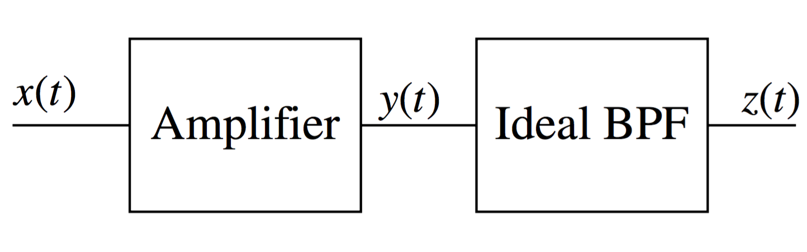

# problems01

##**2.1** 
Let two complex numbers be given as 
$$
    \begin{align*}
    z_1&=x_1+jy_1=\alpha_1\exp{\left(j\theta_1\right)};\\
    z_2&=x_2+jy_2=\alpha_2\exp{\left(j\theta_2\right)};
    \end{align*}
$$

Find
1. $$\Re{\left[z_1+z_2\right]}$$
2. $$\left|z_1+z_2\right|$$
3. $$\Im{\left[z_1z_2\right]}$$
4. $$\arg{\left[z_1z_2\right]}$$
5. $$\left|z_1z_2\right|$$

#### 2.1.1
$$
    \begin{align*}
    \Re{\left[z_1+z_2\right]}&=\Re{\left[x_1+jy_1\right]}+\Re{\left[x_2+jy_2\right]}\\
    &=x_1+x_2\\
    \Re{\left[z_1+z_2\right]}&=\Re{\left[\alpha_1\cos{(\theta_1)+j\left(\alpha_1\sin{(\theta_1)}\right)}\right]}+\Re{\left[\alpha_2\cos{(\theta_2)+j\left(\alpha_2\sin{(\theta_2)}\right)}\right]}\\
    &=\alpha_1\cos{(\theta_1)}+\alpha_2\cos{(\theta_2)}
    \end{align*}
$$
#### 2.1.2
$$
    \begin{align*}
    \left|z_1+z_2\right|&=\left|\left((x_1+x_2)+j(y_1+y_2)\right)\right|=\sqrt{(x_1+x_2)^2+(y_1+y_2)^2}\\
    &=\sqrt{x_1^2+x_2^2+2x_1x_2+2y_1y_2};\\
    \left|z_1+z_2\right|&=\left|\left(\alpha_1\cos{(\theta_1)}+\alpha_2\cos{(\theta_2)}\right)+j\left(\alpha_1\sin{(\theta_1)}+\alpha_2\sin{(\theta_2)}\right)\right|\\
    &=\sqrt{\left(\alpha_1\cos{(\theta_1)}+\alpha_2\cos{(\theta_2)}\right)^2+\left(\alpha_1\sin{(\theta_1)}+\alpha_2\sin{(\theta_2)}\right)^2}\\
    &=\sqrt{\alpha_1^2\cos^2{(\theta_1)}+\alpha_1^2\sin^2{(\theta_1)}+\alpha_2^2\cos^2{(\theta_2)}+\alpha_2^2\sin^2{(\theta_2)}+2\alpha_1\alpha_2\cos{(\theta_1)}\cos{(\theta_2)}+2\alpha_1\alpha_2\sin{(\theta_1)}\sin{(\theta_2)}}\\
    &=\sqrt{\alpha_1^2+\alpha_2^2+2\alpha_1\alpha_2\cos{(\theta_1)}\cos{(\theta_2)}+2\alpha_1\alpha_2\sin{(\theta_1)}\sin{(\theta_2)}},&&\left<\cos{(a)}\cos{(b)}=\frac{1}{2}\left(\cos{(a-b)}+\cos{(a+b)}\right)\right>\\
    &=\sqrt{\alpha_1^2+\alpha_2^2+2\alpha_1\alpha_2\left(\frac{1}{2}\left[\cos{(\theta_1-\theta_2)}+\cos{(\theta_1+\theta_2)}\right]\right)+2\alpha_1\alpha_2\left(\frac{1}{2}\left[\cos{(\theta_1-\theta_2)}-\cos{(\theta_1+\theta_2)}\right]\right)},&&\left<\sin{(a)}\sin{(b)}=\frac{1}{2}\left(\cos{(a-b)}-\cos{(a+b)}\right)\right>\\
    &=\sqrt{\alpha_1^2+\alpha_2^2+2\alpha_1\alpha_2\cos{(\theta_1-\theta_2)}}
    \end{align*}
$$

#### 2.1.3
$$
    \begin{align*}
    \Im{\left[z_1z_2\right]}&=\Im{\left[(x_1+jy_1)(x_2+jy_2)\right]}=\Im{\left[x_1x_2-y_1y_2+j\left(x_1y_2+x_2y_1\right)\right]}\\
    &x_1y_2+x_2y_1;
    \Im{\left[z_1z_2\right]}&=\Im{\left[\alpha_1\alpha_2\exp^{j\left(\theta_1+\theta_2\right)}\right]}
    \end{align*}
$$

##**2.3**
Consider the two signals
$$
    \begin{align*}
    x_1(t)=m(t)\cos(2\pi{f_c}t)\\ 
    x_2(t)=m(t)\sin(2\pi{f_c}t)
    \end{align*}
$$
where the bandwidth of m(t) is much less than fc. Compute the simplest form for the following four signals 
1. $$y_1(t)=x_1(t)\cos(2\pi{f_c}t)$$
2. $$y_2(t)=x_1(t)\sin(2\pi{f_c}t)$$
3. $$y_3(t)=x_2(t)\cos(2\pi{f_c}t)$$
4. $$y_4(t)=x_2(t)\sin(2\pi{f_c}t)$$

##**2.5**
This problems exercises the signal and system tools. Compute the Fourier transform of 
$$
    x(t)=\begin{cases}A\sin{\left(\frac{\pi{t}}{T_p}\right)}&0\geq{t}\geq{T_p}\\0&\text{elsewhere}\end{cases}
$$
and give the value of A such that $$E_u=1.$$ Compute the 40-dB relative bandwidth,$$B_{40}$$, of each signal. 

##**2.7**
This problem uses signal and system theory to compute the output of a simple memoryless nonlinearity. An amplifier is an often used device in communication systems and is simply modeled as an ideal memoryless system, i.e., 
$$
    y(t)=\alpha_1x(t)
$$
This model is an excellent model until the signal levels get large then nonlinear things start to happen, which can produce unexpected changes in the output signals. These changes often have a significant impact in a communication system design. As an example of this characteristic consider the system in Figure 2.11 with the following signal model 
$$
    x(t)=b_1\cos{(200000\pi{t})}+b_2\cos{(202000\pi{t})}
$$
the ideal bandpass filter has a bandwidth of 10 kHz centered at 100 kHz, and the amplifier has the following memoryless model 
$$
    y(t)=a_x(t)+a_3x^3(t)
$$
Give the system output, $$z(t)$$, as a function of $$a_1$$, $$a_3$$, $$b_1$$, and $$b_3$$. 

 

