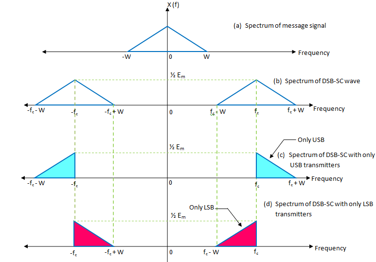

# **week03c**

## SINGLE SIDEBAND MODULATION
- #### Hilbert Transform $$\mathcal{H}$$
$$
    \begin{align*}
    \hat{m}(t)&=\left(\frac{1}{\pi{t}}\right)*m(t)\\
    \hat{M}(f)&=-j\:\text{sgn}(f)\:M(f);
    \end{align*}
$$
###### example#1
$$
\begin{align*}
x(t)&=\sum_{n=1}^{\infty}{X_n\cos{\left(\frac{2\pi{n}t}{T}\right)}};\\
\hat{x}(t)&=\sum_{n=1}^{\infty}{X_n\sin{\left(\frac{2\pi{n}t}{T}\right)}};
\end{align*}
$$
###### example#2
$$
\begin{align*}
m(t)&=\cos{(2\pi{f_c}t)}\\
M(f)&=\frac{1}{2}\left[\delta(f-f_c)+\delta(f+f_c)\right];\\
-j\:\text{sgn}(f)M(f)&=\left(-\frac{j}{2}\right)\left[\delta(f-f_c)-\delta(f+f_c)\right];\\
\hat{m}(t)&=\sin{(2\pi{f_0}t)};
\end{align*} 
$$

- #### passband + baseband of SSB
$$
    \begin{align*}    
    \underset{\text{passband}}{x_c(t)}&=\sqrt{2}A\:m(t)\cos{(2\pi{f_c}t)}\mp\sqrt{2}A\:\hat{m}(t)\sin{(2\pi{f_c}t)}\\
    \underset{\text{baseband}}{x_z(t)}&=A\:m(t)+j(A\:\hat{m}(t));
    \end{align*}
$$
$$
    \begin{align*}
    X_c(f)&=\frac{\sqrt{2}}{2}A\left[M(f-f_c)+M(f+f_c)\right]\mp\left(-j\frac{\sqrt{2}}{2}\right)A\left[\hat{M}(f-f_c)-\hat{M}(f+f_c)\right]\\
    &\left\{\begin{matrix}
    \mathcal{F}{\left\{\sin{(2\pi{f_0}t)}\right\}}=-\frac{j}{2}\left(\delta(f-f_c)-\delta(f+f_c)\right)\\
    \hat{M}(f)=-j\:\text{sgn}{(f)}\:M(f)
    \end{matrix}\right\}\\
    &=\frac{\sqrt{2}}{2}A\left[M(f-f_c)+M(f+f_c)\right]\mp\left(-j\frac{\sqrt{2}}{2}A\right)\left(-j\right)\left[\text{sgn}(f-f_c)M(f-f_c)-\text{sgn}(f+f_c)M(f+f_c)\right]\\
    &=\left(\frac{\sqrt{2}}{2}A\right)\left[M(f-f_c)\left(1-\text{sgn}(f-f_c)\right)+M(f+f_c)\left(1+\text{sgn}(f+f_c)\right)\right];
    \end{align*}
$$
$$
    \left\{
    \begin{matrix}
    1+\text{sgn}(f)=\begin{cases}2&\text{if }f>0\\1&\text{if }f=0\\0&\text{if }f<0\end{cases};&&1+\text{sgn}(f-f_c)=\begin{cases}2&\text{if }f>0\\1&\text{if }f=0\\0&\text{if }f<0\end{cases};\\\\
    1-\text{sgn}(f)=\begin{cases}0&\text{if }f>0\\1&\text{if }f=0\\2&\text{if }f<0\end{cases};&&1-\text{sgn}(f-f_c)=\begin{cases}0&\text{if }f>0\\1&\text{if }f=0\\2&\text{if }f<0\end{cases};
    \end{matrix}\right\}
$$
######example#1
Let's suppose our $$m(t)$$ to be a *triangle* function. 
- one half of the bandwidth is occupied by the **upper sideband** (USB) 
- other half of the bandwidth is occupied by the **lower sideband** (LSB)
as shown in figure below

